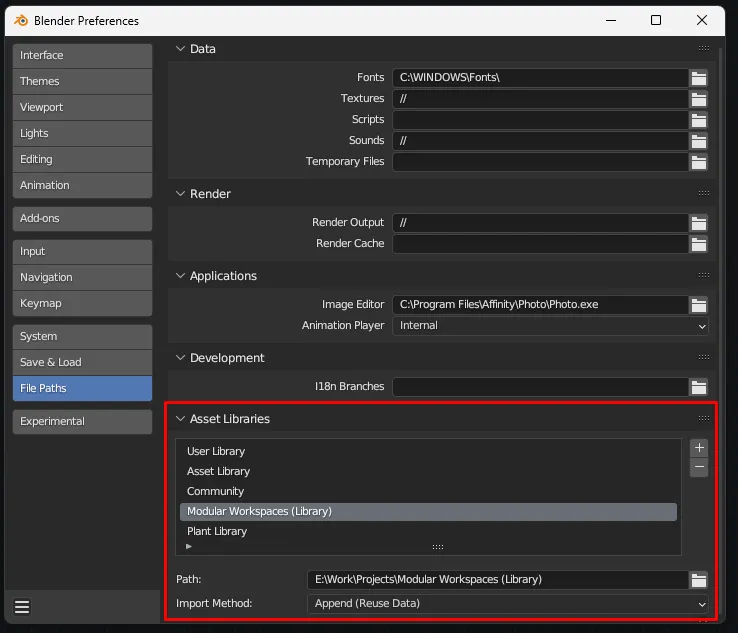

# Modular Workspaces

## **What is it?**

**Modular Workspaces expands the features of the Blender interface**, allowing you to use **customize editor toggle buttons in the 3D view**, and also **streamlines the process of unpacking collection assets** by helping to center them in the world, separate the content, and organize it into collections automatically. An **accompanying asset library** is also included, with presets that will give you a **head-start in your projects**.

#### <a href="https://curtisjamesholt.gumroad.com/l/modular_workspaces" class="button primary" data-icon="dollar-sign">Get it on Gumroad</a>

<a href="https://superhivemarket.com/products/modular-workspaces-for-blender" class="button primary" data-icon="dollar-sign">Get it on Superhive</a>

### Installation

Purchasing the **Modular Workspaces** product will give you access to two main zip files. One is an asset library, and other other is the addon.

You do not need to use the included .zip library file to make use of the addon. It can unpack any collection assets from your own custom asset libraries. The included library in this package contains my personal collection of starter-file presets which you can use and adapt to speed up your own workflow. All of the included assets have been given unique color-coded icons to represent the type of data they contain. This will be explained in more detail below.

### The Library .ZIP File

**Modular Workspaces (Library)...zip**

Once downloaded, you must extract the folder contained inside the zip file anywhere on your computer, and copy the directory. See [this link](https://docs.blender.org/manual/en/dev/files/asset_libraries/introduction.html#introduction) for more information on the asset system in Blender.

* You can create asset libraries by going to Edit - Preferences - File Paths - Asset Libraries.
* Paste the copied directory into the 'path' field.
* Go to the asset browser, refresh the list of libraries, and look for Modular Workspaces (Library).

<figure><figcaption></figcaption></figure>


**In older versions of Modular Workspaces, the asset library came in the form of a single .blend file rather than a .zip file. The more modern .zip file version contains a folder that preserved category data, meaning the content will already be organized into categories once the asset library is open in the asset browser.**


### The Addon .ZIP File

**Modular Workspaces (Addon)...zip**

The downloaded zip file containing the Modular Workspaces addon must be installed using Edit - Preferences - Addons - Install.

See the following page for more information if you bump into any issues:


[installing-python-addons-for-blender.md](../helpful-guides/installing-python-addons-for-blender.md)


You may also install the addon manually by extracting the addon files to the scripts / addons directory in Blender’s AppData, but I would only recommend doing this if you know exactly what you are doing.


{% column width="50%" %}
<figure><figcaption></figcaption></figure>



You will know the addon has been installed correctly when you can see the ‘Modular Workspaces’ tab in the ‘N’ sidebar (press N while hovering the mouse in the 3D view to open / close this sidebar).

When clicking on the tab, you will see a series of panels - Setups, Interface and Information. These contain the basic functionality for the addon.


Screenshots on this documentation page may be out of date. Extra features and parameters may have been added since this was written, so don’t worry if your interface looks slightly different.




### Finding the Content

Once you have installed the **Modular Workspaces** addon and placed the **asset blend file -** Modular Workspaces (Library).blend - inside one of your own asset libraries, you should be good to go!



<figure><figcaption></figcaption></figure>




You must choose your custom asset library from the drop-down in the asset browser interface to see the content contained inside of that library.




### Categories

You can now optionally organize the assets into your own categories. These categories can be structured in any way you like.



<figure><figcaption></figcaption></figure>



My personal preference is to have one major category called ‘Setups’, and create sub-categories for each of the main asset types. That way, I can see all of the content by clicking on Setups, and filter individual types by clicking on the respective sub-categories.



### Asset Types

Each asset has been given a custom icon which has been color-coded to represent the type of data it contains. If you do not like the icons, you can change them in the properties sidebar (press N while hovering over the asset browser to open the sidebar).

<figure><figcaption></figcaption></figure>

🔵 **Blue represents collections which add objects to the scene.**

🟢 **Green represents collections which add lights to the scene.**

🟠 **Orange represents collections which add cameras to the scene.**

🟣 **Purple represents world node groups, which can be dragged into the world node tree.**

Multicolored assets may represent artistic setups, such as those introduced with the [character lighting update](https://youtu.be/wB9wIRe4k2o).

### Asset Browser Buttons

In addition to the unpacking functionality, the addon will add a few extra buttons to the Blender interface to let you quickly access the asset browser from the 3D view.



<figure><figcaption></figcaption></figure>



In the top-right of the 3D view, you will see a button labelled ‘Asset Browser’. Clicking this will split the 3D view and open the asset browser in the newly created editor space.

Version 1.5 improved the button to make sure it properly toggles the asset browser.

Extra buttons can be added and changed in the ‘Left’, ‘Top’, ‘Right’ and ‘Bottom’ area sections of the interface settings.



<figure><figcaption></figcaption></figure>

With version 1.5, your favorite asset browser settings now apply automatically when opening the Asset Browser with the convenience button.

### ❤️ Give it a Try (A Quick Tutorial)

#### World Nodes

First, let’s prepare the world lighting for the scene. This is the least visually-interesting part since there’s nothing in the scene for it to react with, but it’s still an important part of the process. If you have your asset browser open along with the world shader nodes, drag in the following node assets:

* HDRI Template
* HDRI and Color Background

HDRIs (also known as Environment Textures) are images that circle the entire digital world, giving a more realistic projection of lighting over the objects in your scene. You can browse many HDRIs for free on [Poly Haven](https://polyhaven.com/hdris).



<figure><figcaption></figcaption></figure>



<figure><figcaption></figcaption></figure>



As shown in the image above, plug the **Color** output from the **HDRI Template** node into the **HDRI** input of the **HDRI and Color Background** node. After that, connect the HDRI and Color Background node to the World Output node. _Those sentences may be confusing, but hopefully the images will make this easier to understand._

Then you can change the values on the HDRI and Color Background node to alter the look of the world background. I have the HDRI Strength set to 1.0 (meaning that any objects we add to the scene will be given beautiful lighting by the HDRI, and I have also made the background color a brighter blue.

#### 3D Content

Now you have the world lighting set up, it’s time to add some 3D content to the scene.

Drag a few collection assets into your 3D view, such as the diorama object, shadow catcher, camera and 3-Point lighting setup. Then, go up to the Setup panel and press ‘Unpack Setup’.

<figure><figcaption></figcaption></figure>



<figure><figcaption></figcaption></figure>



The Modular Workspaces addon will automatically recenter the content, unpack all of the collections and organise them into new collections in the outliner. This saves you from having to unpack and organise them manually.

By default, the addon will perform this unpacking procedure on all of the collection assets in the scene, however you can optionally tell it to only unpack the selected assets by ticking the ‘Selected Only’ option in the Setup panel.

**Remember:** If you have imported a camera object, you can select it in the outliner and press **CTRL+Numpad 0** to make it the active camera object. If you don’t have a numpad, with the camera object selected, you can press **F3** and search for **Set Active Object as Camera**.



<figure><figcaption></figcaption></figure>

### The Result

You should now see something like the above image. Just by dragging in the elements we wanted and pressing one button, the scene has been automatically prepared for us to start working with. Notice how the objects have also been organized into new collections based on their type.

This can be an extremely fast workflow for giving you maximum variety and choice when starting a file from scratch. If you don’t want to set up the world nodes every time you create a new file, you can add them to your base startup file.

**Note:** To assign your startup file, go to File - Defaults - Save Startup File. This saves the file you currently have open as the starting point - it is what you will see whenever you open Blender from now on.

### Why Use This Workflow?

This workflow tool was created because I wanted to have more control and variety over my startup file without clogging up the outliner or world nodes with all of the presets I might possibly want to use.

One question people might ask is: **Why not just create multiple startup files and use those as regular templates?**

The answer is twofold: **Synchronized parameters and low attention span.**

If I have 15 startup template files for different types of projects, and I want to change one render setting, I will have to do that individually for every template file to bring them all up to date. That is a huge waste of time. With this workflow, I can have **one lightweight startup file** with all of my preferred render settings, and with a **few clicks** just drag the **core elements** I need from the asset browser and **unpack them all with one button press**, where they will be organized into collections for me.

All of the presets are contained in one **highly customizable** blend file that synchronizes with my asset library, making it **easy to backup and iterate upon**. More presets can be easily added over time in **one single location**.

### Modular Thinking

Talking about synchronization, the organization part of the unpacking process is powered by my **EasyBPY python module for Blender**, specifically the `organize_outliner()` function, which is also utilized in the outliner cleanup section of the **Holt Tools addon**. This means that as the module is improved, both addons will benefit from the changes. This is an example of modular design and development.

Another example from my workflow would be the **Modular Metals** product. Most of the materials in that pack are comprised of **procedural ‘builder’ node groups**, each of which can be **individually improved**. In doing so, more complex materials that use those nodes will also benefit from the improvements.

**This Modular Workspaces project is the application of modular thinking to my startup workflow. If you believe your workflow might benefit from using this, then feel free to give it a try!**

### Leaving Suggestions

If you want to leave suggestions for new features that can be added to the addon or presets for the asset library file, then you can submit a request using the [contact form](https://curtisholt.online/contact) on my website, or come over to our community [Discord server](https://curtisholt.online/links) and post your idea there.

### Common Issues

**Assets Missing?**

Make sure you are using the [latest stable version](https://www.blender.org/download/) of Blender. Older versions may not support collection assets, meaning they may not appear in the asset browser.

**Error When Pressing 'Default Params' Button (Pre version 1.5)**

The most common error to occur when pressing the Default Params button is an 'asset library not found' error. This happens because the name in the 'Default Asset Library' text field does not match the name of one of your asset libraries defined in Edit - Preferences - File Paths - Asset Libraries.
