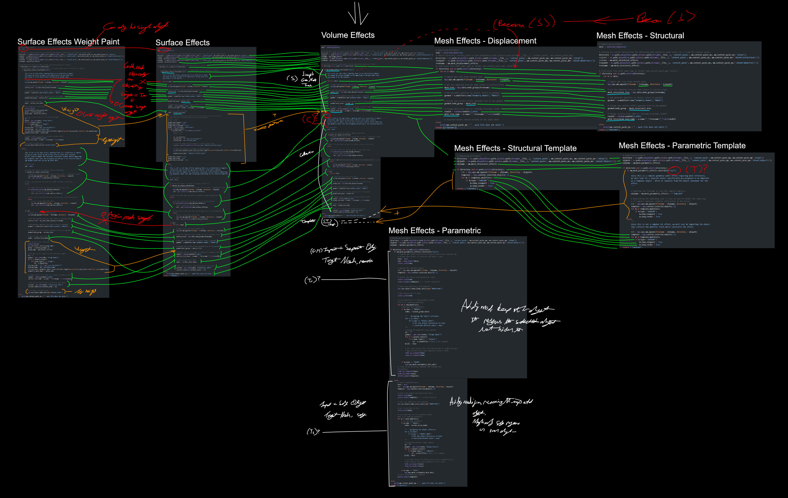

# 18/07/25

BY-GEN - General Preparation&#x20;

* Starting with updating to Blender 4.5, transferred appdata from 4.4 to 4.5, things seem to work. BY-GEN already transferred, going to remove to we can link it up with the visual studio code project.&#x20;
* Executing Blender and building with VSCode, BY-GEN linked successfully.&#x20;
* Created Anki deck for BY-GEN to track and reinforce personal knowledge in the future and as we make important rediscoveries.&#x20;
* \[Anki] Understanding that BY-GEN (on the interface side) is split into 3 core pillars and 3 extended features:&#x20;
  * Surface Effects&#x20;
  * Mesh Effects&#x20;
  * Volume Effects&#x20;
  * Structured Generation&#x20;
  * Scattering&#x20;
  * Tools&#x20;
  * (Additionally: Info)&#x20;
* Noticing that the generator's lab content pack was installed as it is kept in our private repo for BY-Gen. Should keep it there for testing purposes, but also don't want to share that when migrating content to public repo. Setting drop down options to official to keep the same.&#x20;
  * Saving startup file to test if the drop down choices persist on Blender restart - they don't seem to, but maybe due to rebuilding of addon. Did the same with version not linked to VSCode, still did not persist, so property must be stored in other place.&#x20;
* In folder space for BY-GEN noticing many folders but it's confusing to know which are related to functionality and which are misc. For example dev folder is just notes, it would be useful to clean this up or to store functionality under a subfolder but this will require a rewriting of references.&#x20;
* Moved notes from the dev folder into onenote space for these notes. Then deleted dev folder to simplify folder space.&#x20;
* Noticing a 'tools' folder which contains a blend file for a depth tool, but I don't think this is referenced in any code, rather there for the user to find and access if needed.&#x20;
* Noticing that inside of the init.py file, under register() we refer to each of the core functionality python files and call their sub .register() functions, meaning classes are defined on a file-by-file basis. That is good because it means we can work independently in each file and know things are registered without having to put an extra reference to it in the init file. However properties may still need to be defined at the init level, inside of BGProperties. This is defined under the region 'Global Variables and Properties'. There are many sub regions for each of the different categories of effects. Some of this information should be distilled.&#x20;
* \[Anki] How is class registration for multiple files handled in BY-GEN?&#x20;
  * \[Answer With Image] Every file is referenced and their associated .register() functions are called. This triggers registration for every necessary file. Any new files should also be given a .register() function and added to the list in init.py.&#x20;
* While looking at the register classes in other files, I'm noticing some complexity where not only are classes registered from a list of all classes defined in that file, but there is also a long list of other properties being defined, destroyed and re-registered (specifically in the effects.py file), which I believe are related to window management for the visual asset selection boxes. Just checking to see if this complexity is also present in other sub-files. Nope, it seems all files under a subsidiary folder 'operators' that also contain functionality code have unremarkable register functions, so effects.py seems like a spike in complexity.&#x20;
* \[Anki] Which files has the greatest complexity on account of shepherding many window management properties?&#x20;
  * \[Answer With Image] effects.py has many WindowManager props as it is responsible for managing the user interface for external effect/asset selection. They need to be destroyed and recreated in specific orders to maintain functionality.&#x20;
* Noticing the changelog file, looks a bit cluttered in the root directory but think we will leave it there because it will be an important one in the end.&#x20;
* I'm also noticing under a modules folder that we were creating other modules alongside easybpy, in particular: a module for simplifying and interacting with geometry nodes. Surely this is something that could be merged with easybpy but I suppose it depends on if there are any specific requirements for it to stay separate, other than references needing to be re-written in the current codebase.&#x20;
* I am also noticing code for the old modifier stack interpreter tool which I believe is sitting unused. We can keep it there in a specific subfolder.&#x20;
* I'm noticing the content\_packs folder and seeing that each pack has subfolders with specific names for thumbnails. I remember now that these thumbnail files indicate the existence of an associated effect in the file. They all need to share a naming convention. I will open up one of the content packs now and take a look.&#x20;
* I see that the name of the thumbnail '(S) Distribute Points in Volume' is associated with a geometry nodes tree name '(S) Distribute Points in Volume) which is assigned to a Volume Effect Cube object. This is only a single geometry node and I wonder if that's what the (S) stood for (single or simple). &#x20;
* I see that the volume effect cube has nothing to do with the geometry nodes effect, as it is stored in a rendering - volume effects collection which we were clearly using for rendering the effects out, rather than creating them. This will be worth making a note of as we are bumping into many different kinds of self-invented conventions here, so we will need a way to remember and write them down. They were likely mentioned on video, but I would be surprised if I never wrote them down, but then again I was never that good at keeping track of behind the scenes decisions for posterity.&#x20;
* I'm noticing that each of the geometry nodes effects in the official content pack have been flagged with fake users for obvious reasons.&#x20;
* I'm seeing that when applying the cross mesh effect to the volume cube, nothing is showing and I have to assign the 'Cross Mesh' collection to the collection info input in the geo nodes tree manually. I will try to apply it in a simple file using the by-gen addon to try and remember the application process.&#x20;
* It did apply correctly, so it seems as though the collection is assigned in the application process. If so, that's a bit annoying to preview for render tests behind the scenes. We will really need to write out some kind of flow chart to help outline the process.&#x20;
* Before adding more to anki, just want to understand the application process so we can see what is actually happening.&#x20;
* I can see under BYGEN\_OT\_volume\_effect\_import that there are cases with some commented notes explaining the difference between (S) and non-(S) type effects and how they have different methods of import.&#x20;
  * (S) type effects have no collection to import so they can go straight into the importing of the geo nodes tree and assigning it to the selected object/s.&#x20;
  * Non-(S) type effects have a collection to import. Apparently the collection needs to be imported before assigning the geometry nodes tree (is that still the case, or can the collection be dragged with the geo nodes tree on import now - I suppose it's not really an asset as such, at least not when it was created. I wonder if it can be recoded to not require separate import of the collection. I suppose if it works for now, then there's no sense in trying to change it as that will likely cause large issues we are not ready to debug.&#x20;
* Noticing there are lots of finite things to remember such as what kind of data types certain variables are in the import process, that's something we can add to anki.&#x20;
* Yes, I can see at line 1417 colinfo = getnode\_nodes, "Collection Info"), after that the imported collection is assigned to the node, meaning that the collections are attached after import. I wonder how we can simplify this for ease of working with the effect in the content pack file, or maybe we can create a helper script to preview the effects. Regardless, we are putting together a better picture of a mental flow chart that we could describe for reinforcement later.&#x20;
*   I'm pretty sure there was another category of effect for geometry nodes beyond S and non-S, so I'm going to have a quick look through files to see if I can find it.&#x20;

    * In this micro investigation, I'm noticing that Mesh Effects (compared to Surface Effects and Volume Effects) is organized differently in the code. After checking the interface, this is represented by Mesh Effects having several submenus that the other categories do not. The subcategories are Parametric, Structural, Displacement and Helper Tools (naturally for extra operators, not effects).&#x20;
    * \[Anki] Which of the core 3 pillars of BY-GEN has additional sub-categories?&#x20;
      * \[Answer With Image] Mesh Effects, which contains Parametric, Structural and Displacement subcategories (at version 9.1.1)&#x20;
    * I'm checking the content for the official content pack subfolder of the project and noticing that instead of the hierarchy being organized from the 3 pillars (parent to child, where mesh effects would have subfolders of displacement, parametric and structural), they are instead all contained at the root of the content pack. The folders are listed as such:&#x20;
      * Thumbnails\_mesh\_displacement&#x20;
      * Thumbnails\_mesh\_parametric&#x20;
      * Thumbnails\_mesh\_structural&#x20;
      * Thumbnails\_surface\_effects&#x20;
      * Thumbnails\_volume\_effects&#x20;
    * \[Anki] What are the common subfolders that would be present in a content pack containing assets for all of the main pillars of content (remembering surface, mesh and volume)?&#x20;
      * \[Answer With Image] List the bullet points above.&#x20;
    * I'm also seeing a region in the mesh effects section of effects.py called 'Mesh Legacy' - I'm unsure what this is but I'd guess it's the old panel from older versions of BY-Gen before the addition of the more visual preset selection interface (I likely kept it in case the custom asset system didn't work and I needed to revert).&#x20;
    * \[ Time: 1 hour passed ]&#x20;
    * I'm going to look inside of the parametric, structural and displacement sections to see if there are any unique behaviours for these compared to the simpler surface and volume effects sections.&#x20;
    * Under 'Parametric' there are 5 areas of code, two are functions and three are classes, two of which are operators for importing (regular and template) and the other is for the panel definition. I will look under the regular import function before the template import (as there may be added complexity).&#x20;
    * After expanding the BYGEN\_OT\_mesh\_parametric\_import class, I have found what I am looking for (from my vague memory), an expanded case with limited commenting for effects that begin with (G). The comments state the following: \
      "Complex geo nodes stacks which require extra base referencing." \
      I really could have done a better job at explaining that. What follows after that is code with various comments on the procedure for successive lines, but no overview explanation of what the process is actually for. In my memory, I remember that either this or another feature was for auto assigning the object reference to multiple geometry nodes effects  if certain conditions were met (for example if 'target' was the name of a certain input, but that might be incorrect). This is something we need to elucidate to create accurate documentation and clear out understanding for making future effects and improving the functionality in the future.&#x20;
    * I'm now going to read the code and try to bullet point the process for (G) preset imports:&#x20;
      * Get the selected object .&#x20;
      * Copy the selected object&#x20;
      * Select the new object.&#x20;
      * Append the template object (even though this is not the template import function, I remember we are using objects to store entire stacks of modifiers and geometry nodes trees \[quite smart, really], so we import the object as a whole which acts as a trojan horse to bring in all of the effects).&#x20;
      * Select only the object we want to apply things to. (the commenting at 685 is confusing).&#x20;
      * At 687, we \*also\* select the newly imported object with all of the modifiers and geo nodes we want to use.&#x20;
      * Call bpy.ops.object.make\_links\_data(type='modifiers') to copy the entire stack from the imported object to the selected object.&#x20;
      * Then select only the originally selected object again.&#x20;
      * Now, loop through all of the new modifiers on our selected object and assign self references (geometry nodes effects that need to reference the selected object).&#x20;
        * For ever modifier&#x20;
          * If it's a node type&#x20;
            * Get all of the nodes.&#x20;
            * Get nodes of the type 'group input'. (This confuses me as I would have thought the object reference might have needed to be made at the modifier stack level, but I guess this is where the object reference is made (the object input is accessible from the modifier stack).&#x20;
            * For every 'group input'.&#x20;
              * If the name in lowercase is 'object'&#x20;
                * Get the identifier (Oh, I see, there is a text based ID for each of the geometry nodes inputs at the modifier stack level, and what we're doing is a bit of 'forensics' inside of the node group inputs to find out which of the inputs actually \*is\* the object reference.)&#x20;
            * Then take the captured identifier and assign the base object with: \
              m\[id] = base, where 'm' is the modifier itself.&#x20;
      * Then do a hacky trick to refresh the viewport by hiding and unhiding the object because updating the view layer alone is not sufficient.&#x20;
      * Then delete the imported template object (the trojan horse that carries the modifiers and geo nodes). People will never know it existed and yet we are left with all of the relevant data.&#x20;
      * (Looking back, I'm quite impressed at myself because that's actually a smart combination of using bpy.ops to speed up the process by letting it manage the importing of multiple types of data (objects, mesh, modifiers, geo nodes, etc.) and then doing some manual work to make our own data links afterwards, especially the 'forensics' to discover the secret ID of the object input. This is quite a lot of information in one go so we should take some time to Anki the process.&#x20;
    * Looking back at that mini-investigation, I'm taken aback by both the complexity and intuitiveness of finding a solution.&#x20;
      1. Using bpy.ops to 'trojan horse' a large amount of data into the blend file (modifiers and geometry nodes).&#x20;
      2. Copy all of the modifier and geometry nodes data to the originally selected object.&#x20;
      3. Do some node forensics to discover the secret object target ID string (such as 'Input\_3') by assessing the actual group input node in the node tree of each modifier.&#x20;
      4. Assign the originally selected object as the target using the newly discovered ID.&#x20;
      5. Noticing that Blender view layer update is flawed so doing a hacky workaround of hiding and unhiding the object we're working on to force a correct update.&#x20;

    (We should Anki this information as this process for the (G) type geometry nodes effects is important. Also elevate this process for mentioning to public on next update.&#x20;
* Something important I've noticed is that there is a lack of parity between the import classes of different pillars, specifically; where I can see (G) type imports in the parametric mesh effects, I cannot see that case being handled in the volume effects, and I'm wondering why. \
  Fundamentally, all imports manage the same types of data, the main difference between pillars is categorical purpose as highted by the user interface, so I'm considering created a new central function to manage imports that handles all geo nodes effects types and accepts arguments that direct it to specific types of categories. Then, without deleting the previous classes, just point them to the new class, so we keep all of the import functionality central in one place which is easier to modify and expand upon, while also keeping the pillars separated on a user experience level.&#x20;
* I'm also taking a look at other mesh effect types, such as structural, and noticing its import mode is much more simple, on account of it being a multi-object effect. I think it might be a good idea to not only have a central import function but also a type for each effect rather than keep things ambiguous, e.g. ( S ) for simple ( C ) for collection ( T ) for target, etc. This would require fundamental renaming and restructuring for template content packs, but it might be worth it for future development and community extensibility. It would also be easier to demonstrate to people and explain in documentation.&#x20;
* Created a new region in effects.py for work on this central import function - #region V10 WIP.&#x20;
* To start with, I have created the shell of a function as def import\_content, but I am looking at the necessary input variables across different import classes currently available to see which kinds of arguments I need to include for the full suite of functionality. This will likely require a lot of testing.&#x20;
* Need to make a note:&#x20;
  * Volume Effects:&#x20;
    * Directory&#x20;
    * Colpath&#x20;
    * Colname&#x20;
    * Treepath&#x20;
    * Treename&#x20;
  * Mesh Effects - Displacement&#x20;
    * Directory&#x20;
    * Treepath&#x20;
    * Treename&#x20;
  * Mesh Effects - Structural&#x20;
    * Directory&#x20;
    * Colpath (unused)&#x20;
    * Colname (unused)&#x20;
    * Treepath&#x20;
    * Treename&#x20;
  * Mesh Effects - Parametric&#x20;
    * Directory&#x20;
    * Objpath&#x20;
    * Objname&#x20;
  * Surface Effects&#x20;
    * Directory&#x20;
    * Colpath&#x20;
    * Colname&#x20;
    * Treepath&#x20;
    * Treename&#x20;
  * Surface Effects - Weight Paint&#x20;
    * Directory&#x20;
    * Colpath&#x20;
    * Colname&#x20;
    * Treepath&#x20;
    * Treename&#x20;
  * All different variables&#x20;
    * Directory&#x20;
    * Colpath&#x20;
    * Colname&#x20;
    * Objpath&#x20;
    * Objname&#x20;
    * Treepath&#x20;
    * Treename&#x20;
* It occurs to me after looking at this list that surface effects also support a weight paint mode that I nearly forgot about - it seems there is always a use case exception to a universal function.&#x20;
* From the looks of it, the weight import functions are mostly the same but look to see if a particular geo nodes tree just so happens to have an input with the name 'weight', so we could just do a boolean toggle to look for that.&#x20;
* Now, for our new function, we should look through each of the pre-existing import classes and add their functionality to this, using the passed function arguments, and place a line of code to call the function (maybe leave it commented out before we swap it with the currently active functionality.&#x20;
* It occurs to me that there may be important subtleties between the different importing methods, but I believe all of them can be unified, however it may take a certain kind of cognitive approach. It might be beneficial to do some kind of direct comparison between the lines of code, maybe color or number coding them in some kind of canvas to see how similar they are. It's hard to do in just a code editor, so I might take some time to break it down in affinity designer.&#x20;
* \[ Time: 2 hours passed ]&#x20;
* Each of the import classes have been laid out on an image canvas, now I am reading and comparing.&#x20;
* It occurs to me while comparing that we could (in theory) just throw all of the code classes into this one function and separate them by cases, but that would defeat the point of trying to condense things.&#x20;
* So far discovered:&#x20;
  * Mesh Effects - Displacement is identical to Volume effects (S) case with the exception of differently named variables. These displacement effects could be renamed to use the (S) convention and therefore would be able to use the same code, so that (in theory) can be condensed. They also both use arguments treename and treepath.&#x20;
  * Mesh Effects - Structural is identical to mesh effects displacement, which is also identical to the (S) case of volume effects. Therefore ME-Displacement and ME-Structural can both be condensed into the same kind of case, if their geo nodes trees are renamed, and we take the volume effects cases as a starting point for our new function.&#x20;
  * Mesh Effects - Structural template is different from the other cases as it is just a complete template object import followed by a look at the modifiers for subsurf to enable.&#x20;
  * Interestingly (and maybe confusingly), mesh effects - parametric template importer is different from the structural template importer, in that it also looks for (G) types. However the non-G-type case is the same as the structural template. So it looks like we will need to add a (G) (or T if renamed) case exception to the template case.&#x20;
  * I'm understanding that there is deeper complexity in the mesh effects - parametric import class, a hidden deviation in the (G) type effects where with G, a separate object is kept hidden after being imported to act as the host of the effect, whereas without G, the modifier stack is attached to the originally selected object, so it is itself the host. In both cases, node checks are done to find any required target assignments in modifier inputs. I suppose if none exist with the name of object, then nothing happens. In theory, this else case (which I will nickname the target self method), can also act perfectly as a regular effect import for copying the modifier stack of an object from another file to the current file on the selected object. Now we just need to see how the surface effects fit into this plan.&#x20;
    * So far, I have the following ideas for geometry node effect / application types:&#x20;
      * (S) For simple geometry node single effects.&#x20;
      * (C) For geometry node single effects which also require the importing of a collection asset that will also be assigned in the node tree.&#x20;
      * (Tr) Target remote - for objects with multi-effect modifier stacks which require a separate object to host (the original object will be hidden). Node checks are done to auto-assign 'object' inputs to the now hidden, remote, original object.&#x20;
      * (Ts) Target self - for objects with multi-effect modifier stacks in which the entire modifier stack is kept on the self, and references self. Node checks are done to auto-assign 'object' inputs to the self object.&#x20;
  * On a quick surface glance of the surface effects, I can see the use of (S), which might suggest parity with the earlier volume effects import of (S), but I expect there is more complex functionality. I see a case for creating and assigning an ambient occlusion group, which is clearly not required for the volume effect, but it seems dependent on there being a group input called ( c ) ambient occlusion.&#x20;
    * I'm now thinking that for things like this (input and node activated features), maybe they should be kept as independent of specific cases, as it may be suitable to let people 'summon' features like this simply by leaving the right kind of trail in their input design or specific nodes in the tree. Maybe that's too much to think about for now - the priority is to condense the importing into one function.&#x20;
  * \[ Time: 3 hours passed ]&#x20;
  * Nearly completed planning, just looking at surface effects weight paint case, and noticing this one is geared entirely for single object application given the integration of weight painting the selected object. This is not completely compatible with all of the other code as the other cases support multiple objects. However, one thing learnt from easybpy is we can pretend a list is only a single object, or force it to be, so it might be worth adding an argument called 'single' to our new function, and if True then we make the objs list only contain the active object.&#x20;
  * I'm also noticing a chunk of code specifically for setting up the weight painting which will likely require another specific argument, so adding that to the speculative function argument list now.&#x20;
  * After testing the interface in Blender, I can also see that weight painting is broken, so after moving everything to the new function, we will likely still need to fix that.&#x20;
  * I'm going to include a quick image to show how the different code cases for each type of import method are being compared.&#x20;

<figure><figcaption></figcaption></figure>

* I think there is enough information now to start drafting out a version of the unified function, even if the code is not complete (portions will likely be pseudocode until it is refined).&#x20;
* I have copied over the original code from the volume effects import class as the starting point for creating the new unified function, just like how I started mapping with the same class above.&#x20;
* Basic code from mesh effects - parametric template has also been copied over to the unified function where appropriate in a template considering case. Changes will still need to be made to the naming conventions. I will try to get all of the basic original code into general place before refining and making it actually work.&#x20;
* Code from mesh effects - parametric has also been added with the speculative Tr and Ts case versions (still referred to as (G) at the moment).&#x20;
* Now all original code has been put into the speculative unified function, it is ready for refinement, a whole lot of checking, and then testing. We also need to completely re-structure the previous presets and template content to follow the new naming conventions. That could be quite a lot of work. We are now coming up to the four hour mark, which is all the patrons have paid for, so now I need to decide whether to carry on in my own time. It might be worth communicating the updates to people so far, but ideally not leaving it too long before continuing.&#x20;
* Thankfully there are backups in the form of gumroad, blender market and github, since we will be making large sweeping changes. I think now might be a good idea to start updating all of the content in the official pack to reflect the new naming conventions. We will also need to update the names of the thumbnails too, I imagine. To focus, I have the following main priorities:&#x20;

- [x] &#x20;Update naming convention for all content.&#x20;
  * [x] Collection names for surface effects with collections.&#x20;
  * [x] &#x20;Geometry node tree names.&#x20;
  * [x] &#x20;Thumbnail names.&#x20;
- [ ] &#x20;Link old classes to new universal function.&#x20;
- [ ] &#x20;Do import / application tests and debug.&#x20;

* \[ Time: 4 hours passed ]&#x20;
* Added a note in the helper text document in the official content pack that the text will need to be updated to reflect version 10 changes.&#x20;
* Changed the collection names of the original surface effects.&#x20;
* Added a File Data workspace in the official content pack to make it easier to access the different data types, mostly for renaming.&#x20;
* Surface effect geometry node trees have also been renamed, now going to look at the thumbnail files for the surface effects specifically.&#x20;
* Thumbnail file names have also been changed and when refreshing the content in the by-gen surface effects panel, I can see those name changes reflected. Before I do any code based testing, I need to also update the conventions for the other content stored in the official file.&#x20;
* Now looking at Mesh Effects – Parametric presets and using the map created earlier to realize that they are (Ts) based effects, meaning target self – to copy modifier stacks from the original source objects to the target of the current file.&#x20;
* The names of the objects have been updated for the parametric effects from the official content pack, now going to do the thumbnail files.&#x20;
* The thumbnail names have been updated and are now reflected in the BY-GEN interface. I do not believe any geometry node trees are required to have any name changes for this kind of effect as it is copied over as an object whole.&#x20;
* Now for mesh effects – structural. According to the map, these should be (S) types, however they can also be imported as a template.&#x20;
* Deciding to try and give the geometry node tree, the object name and the thumbnail file names the (S) prefix and hope that's fine.&#x20;
* Now for the volume effects, these can either be (S) or (C) types according to the map, but each of the originals are (C) type as they use collection content. Actually, looking again, two of them already have the (S) prefix, so there was a mix of types. So we just need to rename the others.&#x20;
* Looks like the volume effects are now done as well. It's now 1am and I should stop soon. The next step is to replace the code in the old import classes with a reference to the new function. Maybe it would be a good idea to not delete the old code immediately, just disable and hide it in a collapsible region.&#x20;
* \[ Ending work for day, 18/07/25, 4 hours and 26 minutes ]&#x20;
